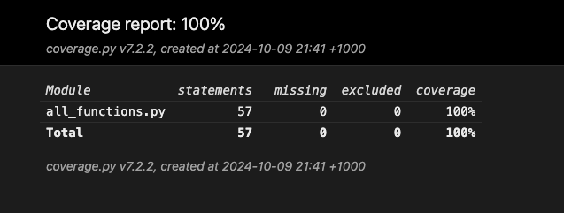
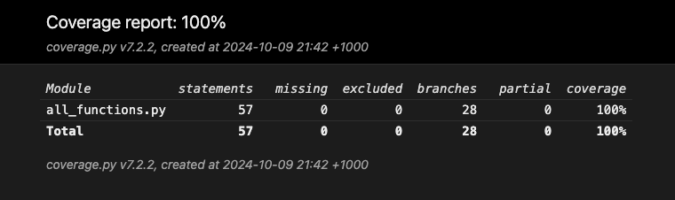

# Coverage Testing Report

Please provide your GitHub repository link.
### GitHub Repository URL: https://github.com/SuhyunKimm/Milestone1_Group001

---

## 1. **Test Summary**

| **Tested Functions** |
|----------------------|
|`def get_data(path)`|
|`def search_food_by_name(df, name)`|
|`def get_food_name_and_calorie(df)`|
|`extract_nutrient_info(result)`|
| `prepare_nutrients(nutrients)`            | 
| `categorize_nutrition(value, max_value)`      |
| `nutrition_level_filter(df)`                |
| `filter_by_nutrition_and_level(df,nutrition_type, desired_level)`                |
| `filter_foods_by_nutrient(df, RF_nutrient_name, RF_min_value, RF_max_value)`                |

---

## 2. **Statement Coverage Test**

### 2.1 Description

To make sure each statement in the code is executed at least once, we made and considered any exceptions or errors that could occur and make those exceptions return different value to the others.

### 2.2 Testing Results

## 3. **Branch Coverage Test**

### 3.1 Description

To ensure that all possible branches have been tested, we made any possible scenarios to be handled by using if-else.

### 3.2 Testing Results

