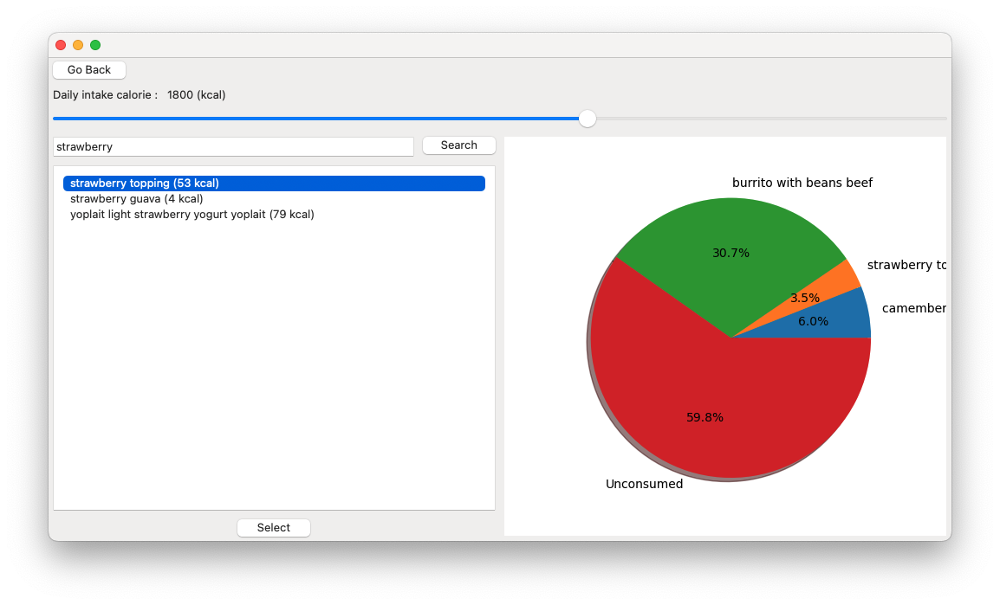

# Executive Summary

Please provide your GitHub repository link.
### GitHub Repository URL: https://github.com/SuhyunKimm/Milestone1_Group001

---

You should use your software to prepare an executive summary as outlined below for the five required features.

## 1. Food Search
### Description  
Briefly describe what this feature does.

### Steps
1. Step-by-step instructions for using this feature.
2. Add additional steps as needed.

### Screenshots
Include screenshots for each step demonstrating the use of this feature.  

---

## 2. Nutrition Breakdown
### Description  
Briefly describe what this feature does.

### Steps
1. Step-by-step instructions for using this feature.
2. Add additional steps as needed.

### Screenshots
Include screenshots for each step demonstrating the use of this feature.  

---

## 3. Nutrition Level Filter
### Description  
Briefly describe what this feature does.

### Steps
1. Step-by-step instructions for using this feature.
2. Add additional steps as needed.

### Screenshots
Include screenshots for each step demonstrating the use of this feature.    

---

## 4. Nutrition Range Filter
### Description  
Briefly describe what this feature does.

### Steps
1. Step-by-step instructions for using this feature.
2. Add additional steps as needed.

### Screenshots
Include screenshots for each step demonstrating the use of this feature.    

---

## 5. Calorie Tracker
### Description  
The calorie tracker enables users to monitor their daily calorie intake by setting a personalized calorie goal and selecting food items they have consumed or plan to consume.

### Steps
1. Select 'Nutrition Tracker' from the main page.
2. Set your personalized calorie goal using the adjustable slider.
3. Search for a food item by entering its name in the search bar.
4. Select the desired food item by clicking 'Select' button beneath the list of results.
5. View a pie chart displaying the nutritional breakdown of all added food items.

### Screenshots

---

