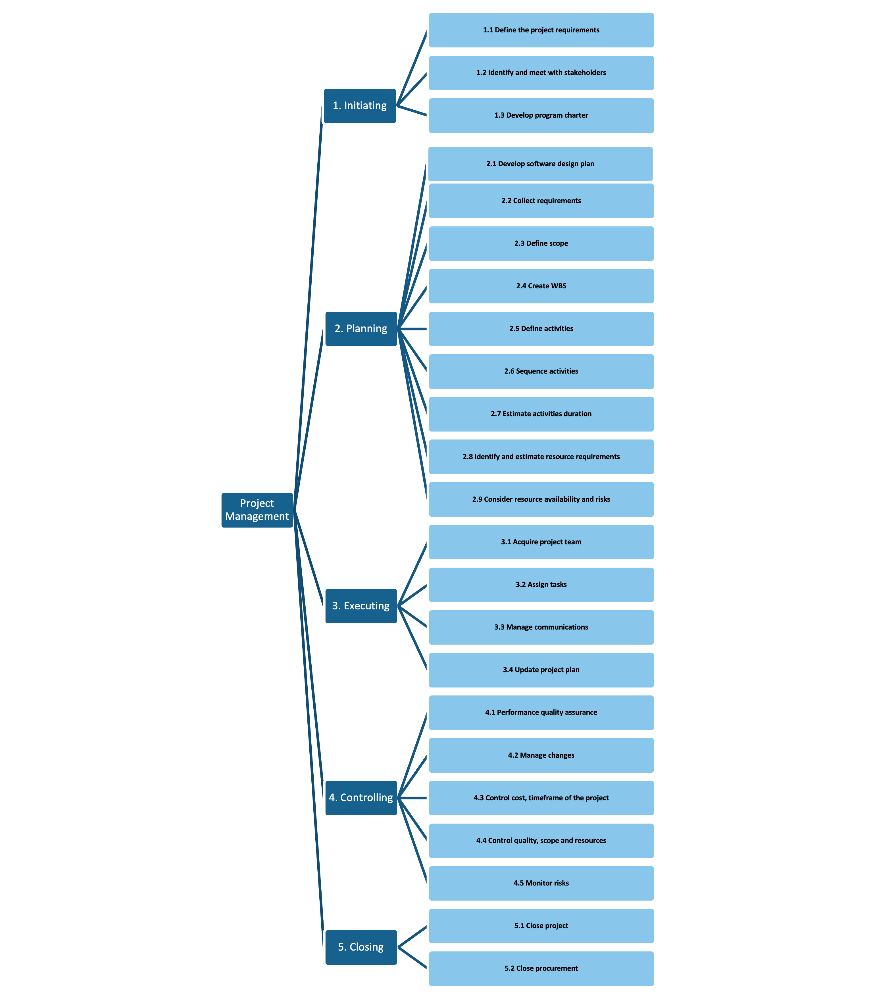
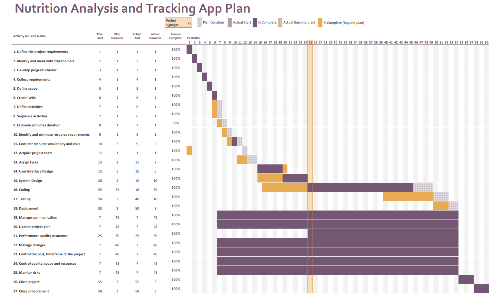

# Project Plan

## Project Name: XXXX
## Group Number: 001

### Team members

| Student No. | Full Name | GitHub Username | Contribution (sum to 100%) |
|-------------|-----------|-----------------|----------------------------|
| s5373168    | Suhyun Kim| SuhyunKimm      | 33.3% or Equal             |
| s5292413    | Vincent To| dato1403        | 33.3% or Equal             |
| s5384131    | Huyen Trang Vu |HtrangVu    | 33.3% or Equal             |

### Brief Description of Contribution

Please Describe what you have accomplished in this group project.
- s111111, Full name
 - Accomplishments: Describe what you have completed or achieved
- s222222, Full name
 - Accomplishments: Describe what you have completed or achieved
- s333333, full name
 - Accomplishments: Describe what you have completed or achieved

# Table of Contents

* [Project Plan](#project-plan)
 * [1. Project Overview](#1-project-overview)
   * [1.1 Project Objectives](#11-project-objectives)
   * [1.2 Project Stakeholders](#12-project-stakeholders)
   * [1.3 Project Scope](#13-project-scope)
 * [2. Work Breakdown Structure](#2-work-breakdown-structure)
 * [3. Activity Definition Estimation](#3-activity-definition-estimation)
 * [4. Gantt Chart](#4-gantt-chart)

## 1. Project Overview

### 1.1 Project Objectives
 Project name: Food nutrition tracking app

The objective of this project is to develop a user-friendly software application that enables users to efficiently browse and retrieve nutritional information from a comprehensive food database. The program will provide key features such as searching for foods by name and displaying detailed nutritional data, including calories, macronutrients, vitamins, and minerals. Success will be measured by the program’s accuracy in delivering nutritional information, ease of use, and user satisfaction with the search functionality.

### 1.2 Project Stakeholders

Internal:

* Programmers : Develop the program with a focus on ensuring it performs all required functions effectively while providing a user-friendly graphical user interface (GUI). Their role includes implementing features such as food search, nutritional information display, and data visualisation, ensuring the system is intuitive and responsive.

* Data Analyst :  Analyse nutritional data and deliver insights as requested by users or the system. They are responsible for generating visualisations that effectively communicate nutritional information, enabling users to easily interpret and make decisions based on the data provided.

* Marketing team : promote the application, creating awareness and develop marketing strategies, gather user feedback to inform future enhancements.

* Company’s management team : Set up the project management plan and keep track of the process, allocate budget and resources, set project priorities, review progress reports, and make key decisions to ensure project alignment with company goals. 

External:

* Potential end-users: Individuals who will use the program to search and retrieve nutritional information, provide feedback on the application’s usability and functionality, report any issues, and suggest improvements.

* Client company executives: define project requirements, provide feedback during development, review project milestones, and ensure the application meets their business needs and expectations.

### 1.3 Project Scope

Project scope statement: The scope of this project includes the development, testing, and deployment of a software application that allows users to browse nutritional data of foods from a nutritional food database. 

Project deliverable:
This project will allow users to do these functions: search food by name and display nutritional information integration of detailed nutritional data, including calories, macronutrients (proteins, fats, carbohydrates), vitamins, and minerals.

Project acceptance criteria:
* User Centred Design theory applied to ensure the high usability of the application.
* The application meets the performance requirements of response time, and provides stable performance.
* ###Users' credentials and personal information are encrypted and not stored in plain text.]
* The application is able to be updated over-the-air with new databases.

This project excludes :
The project does not include the creation or maintenance of the nutritional food database itself.
The project will not cover mobile application development; it will be limited to desktop/web applications.
Application must be compatible with major web browsers.

## 2. Work Breakdown Structure
- Project Management
	- Initiating
		- Define the project requirement
   		- Identify and meet with stakeholder
		- Develop program charter
	- Planning
		- Develop Software Design Plan
		- Collect requirements
		- Define scope
		- Create WBS
		- Define activities
		- Sequence activities
		- Estimate activities duration
		- Identify and estimate resource requirements
		- Consider resource availability and risks
	- Executing
		- Acquire project team 
		- Assign tasks
		- User Interface Design
		- System Design
		- Development/Coding
		- Testing
		- Deployment
		- Manage communications
		- Update project plan
	- Controlling
		- Performance quality assurance
		- Manage changes
		- Control cost, timeframe of the project
		- Control quality, scope and resources
		- Monitor risks
	- Closing
		- Close project
		- Close procurement

## 3. Activity Definition Estimation

Define the activities required for your project based on the WBS, and assign responsibilities to team members. Each activity should be numbered and correspond with your Gantt chart. Provide estimated durations for each activity to facilitate Gantt chart preparation.

| Activity #No | Activity Name | Brief Description | Duration | Responsible Team Members |
|--------------|---------------|-------------------|----------|--------------------------|
|Activity 1|  Define the project requirements | Document and clearly define the key objectives and requirement of the project | 1 day| All |
|Activity 2| Identify and meet with stakeholders|Determine key stakeholders and arrange meetings to gather their input and align project goals|1 day | All???? |
| Activity 3| Develop program charter|Create a document outlining the purpose, scope, objectives, stakeholders, tasks and activities, roles and responsibilities, budget, resources, risks and timeline of the project.| - day      | All |
| Activity 4| Collect requirements | Gather detailed project needs and expectations from stakeholders including detailed features for the application|1 day| All |
| Activity 5| Define scope | Document project scope statement, project deliverable, project acceptance criteria and exclusion| 1 day | All |
| Activity 6| Create WBS | Break down the project to smaller and manageable tasks. Organise and plan the work | 1 day | All |
| Activity 7| Define activities |Identify and specify the tasks and actions that need to be completed to achieve the project goal with details.| 1 day | All |
| Activity 8| Sequence activities| Arrange project tasks in logical order for efficient execution| 1 day | All |
| Activity 9| Estimate activities duration | Estimate the amount of required time to complete each activity in the project and ensure the deadlines are met | 1 day | All |
| Activity 10| Identify and estimate resource requirements | Create a list of resources needed for the project, including human resource, equipment, software and tools, with estimated costs based on quantity, amount or time to be spent. Review the list and revise if needed | 3 days|All|
| Activity 11| Consider resource availability and risks |Assess resource availability and identify potential risks to ensure smooth project execution|1 day|All|
| Activity 12|  Acquire project team| Select and assign the necessary team members for the project| 1 day |All|
| Activity 13|  Assign tasks| Allocate specific tasks to team members| 1 day | All|
| Activity 14|  Manage communications|Ensure effective information flow among project stakeholders by consistent communication|???|All|
| Activity 15|Update project plan|Revise the project plan to reflect changes and ensure alignment with current objectives| 3 days|All|
| Activity 16|Performance quality assurance|Monitor and evaluate project outputs to ensure they meet the required standards and performance criteria| 3 days|All|
| Activity 17| Manage changes | Identify, evaluate and approve changes to the project; implement the changes and update the project plan | ???? | All |
| Activity 18|Control the cost, timeframe of the project|Monitor and manage the budget and schedule by comparing project’s progress to the plan and making adjustments to ensure the project stays within its planned limits.| - days|All|
| Activity 19|Control quality, scope and resources|Monitor and adjust project quality, scope, and resource use to ensure alignment with objectives and standards| ???|All|
| Activity 20|   Monitor risks |Track and assess potential risks throughout the project to mitigate their impact|???|All|
| Activity 21|Close project| Finalise all project activities, ensure all the requirements and deliverables are met, and conduct a final review | 3 days | All |
| Activity 22|Close procurement|Finalise and complete all procurement activities, ensuring contracts and agreements are fulfilled and resolved |3 days|All|

## 4. Gantt Chart
You have to use the provided Gantt chart template. 

Use the provided Gantt chart template to list all items from the Activity Definition along with relevant estimates
and scheduling. Ensure that the Gantt chart reflects the activity definitions from Section 3. Track actual start
times and durations. Besides including Gantt chart here, you should also submit your Gantt chart file separately.

