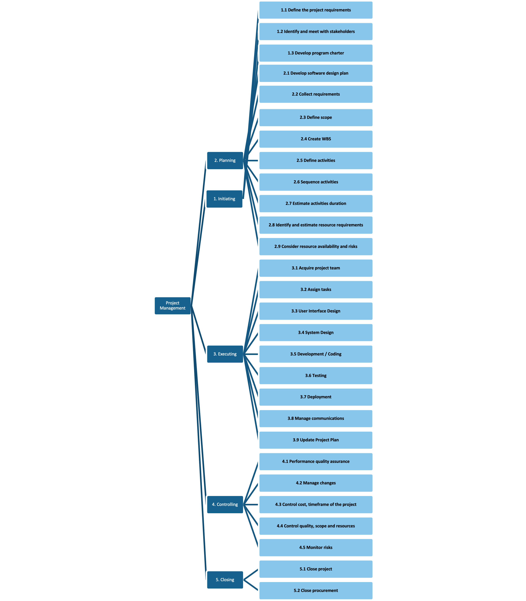

# Project Plan

## Project Name: XXXX
## Group Number: 001

### Team members

| Student No. | Full Name | GitHub Username | Contribution (sum to 100%) |
|-------------|-----------|-----------------|----------------------------|
| s5373168    | Suhyun Kim| SuhyunKimm      | 33.3% or Equal             |
| s5292413    | Vincent To| dato1403        | 33.3% or Equal             |
| s5384131    | Huyen Trang Vu |HtrangVu    | 33.3% or Equal             |

### Brief Description of Contribution

Please Describe what you have accomplished in this group project.
- s111111, Full name
 - Accomplishments: Describe what you have completed or achieved
- s222222, Full name
 - Accomplishments: Describe what you have completed or achieved
- s333333, full name
 - Accomplishments: Describe what you have completed or achieved

# Table of Contents

* [Project Plan](#project-plan)
 * [1. Project Overview](#1-project-overview)
   * [1.1 Project Objectives](#11-project-objectives)
   * [1.2 Project Stakeholders](#12-project-stakeholders)
   * [1.3 Project Scope](#13-project-scope)
 * [2. Work Breakdown Structure](#2-work-breakdown-structure)
 * [3. Activity Definition Estimation](#3-activity-definition-estimation)
 * [4. Gantt Chart](#4-gantt-chart)

## 1. Project Overview

### 1.1 Project Objectives
 Project name: Food nutrition tracking app

The objective of this project is to develop a user-friendly software application that enables users to efficiently browse and retrieve nutritional information from a comprehensive food database. The program will provide key features such as searching for foods by name and displaying detailed nutritional data, including calories, macronutrients, vitamins, and minerals. Success will be measured by the program’s accuracy in delivering nutritional information, ease of use, and user satisfaction with the search functionality.

### 1.2 Project Stakeholders

Internal:

* Programmers : Develop the program with a focus on ensuring it performs all required functions effectively while providing a user-friendly graphical user interface (GUI). Their role includes implementing features such as food search, nutritional information display, and data visualisation, ensuring the system is intuitive and responsive.

* Data Analyst :  Analyse nutritional data and deliver insights as requested by users or the system. They are responsible for generating visualisations that effectively communicate nutritional information, enabling users to easily interpret and make decisions based on the data provided.

* Marketing team : promote the application, creating awareness and develop marketing strategies, gather user feedback to inform future enhancements.

* Company’s management team : Set up the project management plan and keep track of the process, allocate budget and resources, set project priorities, review progress reports, and make key decisions to ensure project alignment with company goals. 

External:

* Potential end-users: Individuals who will use the program to search and retrieve nutritional information, provide feedback on the application’s usability and functionality, report any issues, and suggest improvements.

* Client company executives: define project requirements, provide feedback during development, review project milestones, and ensure the application meets their business needs and expectations.

### 1.3 Project Scope

Project scope statement: The scope of this project includes the development, testing, and deployment of a software application that allows users to browse nutritional data of foods from a nutritional food database. 

Project deliverable:
This project will allow users to do these functions: search food by name and display nutritional information integration of detailed nutritional data, including calories, macronutrients (proteins, fats, carbohydrates), vitamins, and minerals.

Project acceptance criteria:
* User Centred Design theory applied to ensure the high usability of the application.
* The application meets the performance requirements of response time, and provides stable performance.
* ###Users' credentials and personal information are encrypted and not stored in plain text.]
* The application is able to be updated over-the-air with new databases.

This project excludes :
The project does not include the creation or maintenance of the nutritional food database itself.
The project will not cover mobile application development; it will be limited to desktop/web applications.
Application must be compatible with major web browsers.

## 2. Work Breakdown Structure
- Project Management
	- Initiating
		- Define the project requirement
   		- Identify and meet with stakeholder
		- Develop program charter
	- Planning
		- Develop Software Design Plan
		- Collect requirements
		- Define scope
		- Create WBS
		- Define activities
		- Sequence activities
		- Estimate activities duration
		- Identify and estimate resource requirements
		- Consider resource availability and risks
	- Executing
		- Acquire project team 
		- Assign tasks
		- Manage communications
		- Update project plan
	- Controlling
		- Performance quality assurance
		- Manage changes
		- Control cost, timeframe of the project
		- Control quality, scope and resources
		- Monitor risks
	- Closing
		- Close project
		- Close procurement

## 3. Activity Definition Estimation

Define the activities required for your project based on the WBS, and assign responsibilities to team members. Each activity should be numbered and correspond with your Gantt chart. Provide estimated durations for each activity to facilitate Gantt chart preparation.

| Activity #No | Activity Name | Brief Description | Duration | Responsible Team Members |
|--------------|---------------|-------------------|----------|--------------------------|
| xxx          | xxx           | xxx               | xxx      | xxx \& yyy               |
| xxxx         | xxx           | xxx               | xxx      | All                      |
| xxxx         | xxx           | xxx               | xxx      | xxx                      |

## 4. Gantt Chart
You have to use the provided Gantt chart template. 

Use the provided Gantt chart template to list all items from the Activity Definition along with relevant estimates
and scheduling. Ensure that the Gantt chart reflects the activity definitions from Section 3. Track actual start
times and durations. Besides including Gantt chart here, you should also submit your Gantt chart file separately.

