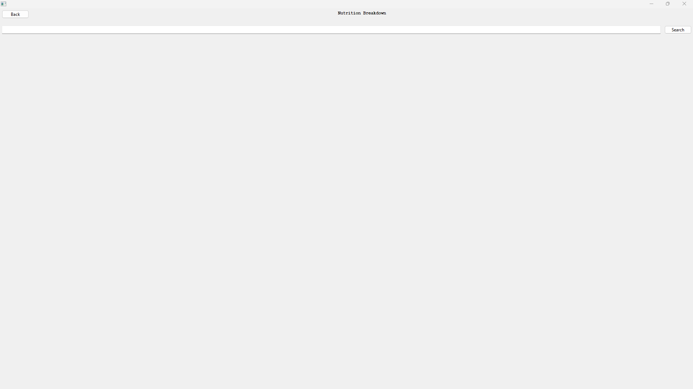
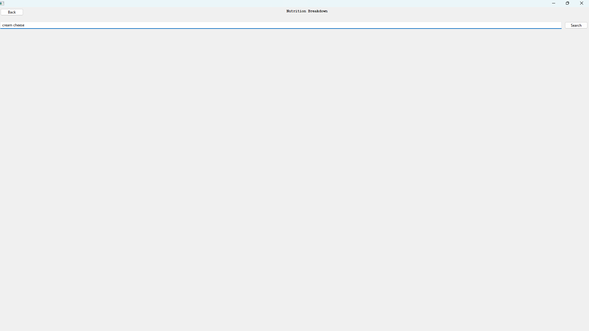
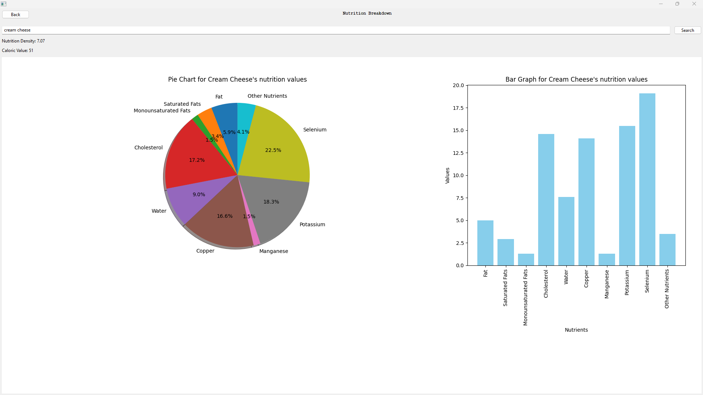
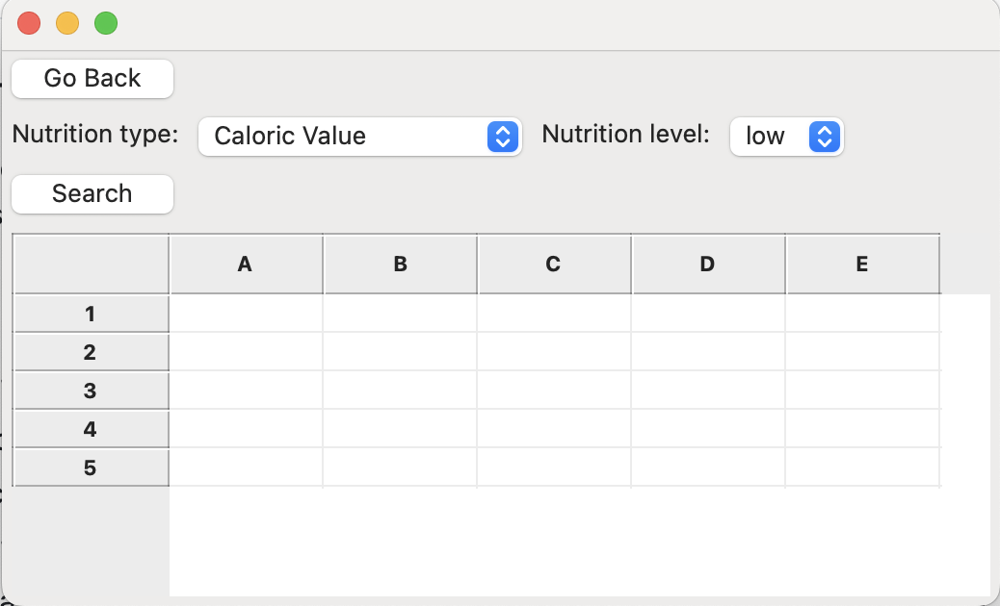
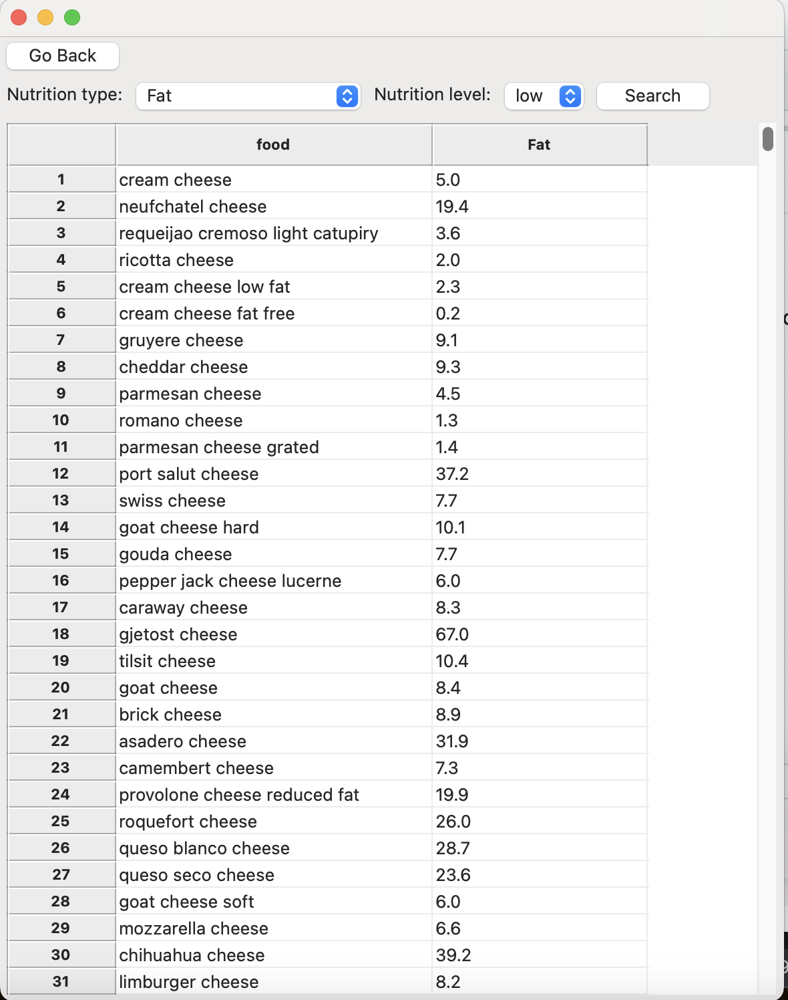
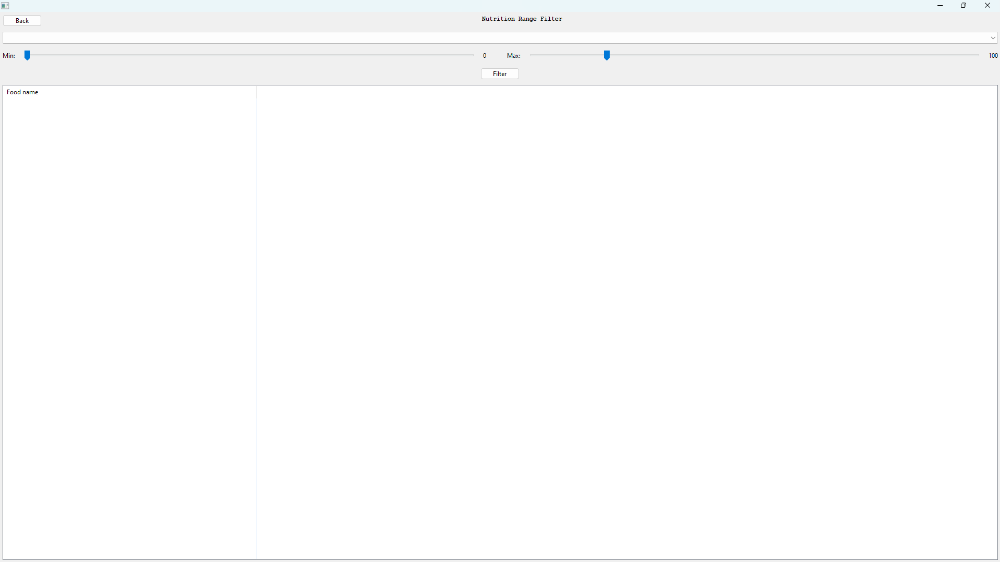
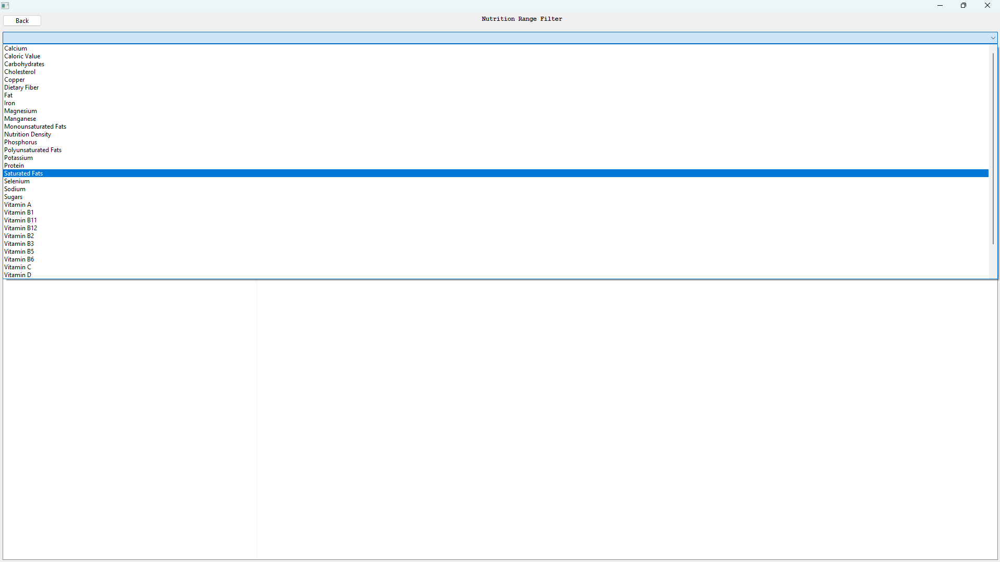
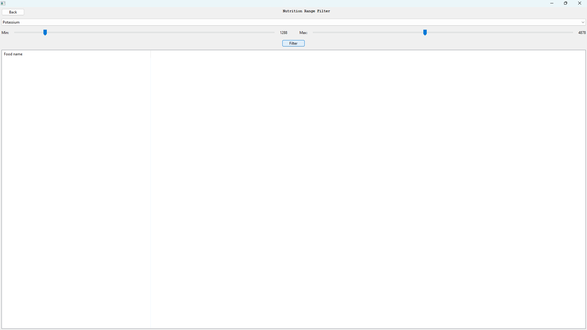
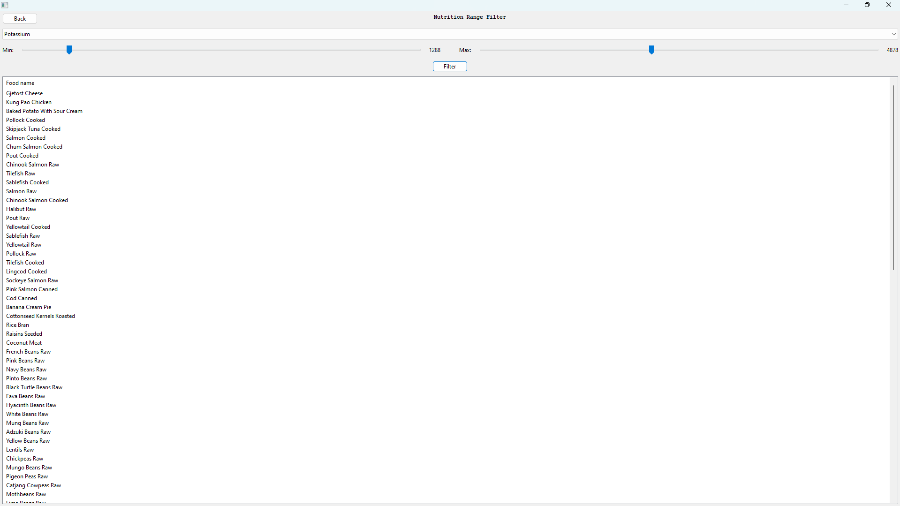
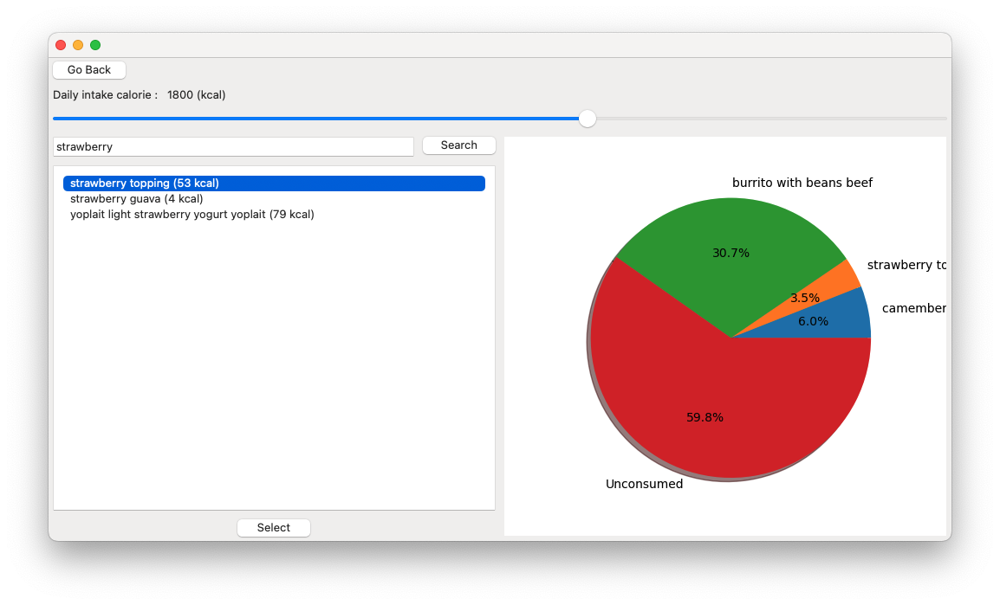

# Executive Summary

### GitHub Repository URL: https://github.com/SuhyunKimm/Milestone1_Group001

---

You should use your software to prepare an executive summary as outlined below for the five required features.

## 1. Food Search
### Description  
Briefly describe what this feature does.

### Steps
1. Select 'Food search' from the main page
2. Enter the food name in the search box.
3. Select search button.
4. Result display all the food containing key word.

### Screenshots
Include screenshots for each step demonstrating the use of this feature.  

---

## 2. Nutrition Breakdown
### Description  
The Nutrition Breakdown feature allows users to view the breakdown of the nutrients of selected food via an Pie chart and a Bar graph. The charts and graphs combine all the nutrients have values less than 1 into a group called 'Other nutrients'.

### Steps
1. Select 'Nutrition Breakdown' from the main page.
2. Enter food name into the search box.
3. Select 'Search' button to search.
4. View the Pie chart and Bar graph.

### Screenshots
Include screenshots for each step demonstrating the use of this feature.  

---

## 3. Nutrition Level Filter
### Description  
Briefly describe what this feature does.

### Steps
1. Select Nutrition Level Filter from the screen.
2. Select nutrition type and nutrition level from the drop down.
3. Select search button.
4. Result display all the food within the range.

### Screenshots
Include screenshots for each step demonstrating the use of this feature.    

---

## 4. Nutrition Range Filter
### Description  
This feature allows users to filter all the foods within the selected range of nutrition value.

### Steps
1. Select 'Nutrition Range Filter' from the main page.
2. Select nutrition from the drop box.
3. Select 'Max value' using the Max slider.
4. Select 'Min value' using the Min slider.
5. Select 'Filter' button to search.
6. View the filtered food in the list.

### Screenshots
Include screenshots for each step demonstrating the use of this feature.    

---

## 5. Calorie Tracker
### Description  
The calorie tracker enables users to monitor their daily calorie intake by setting a personalized calorie goal and selecting food items they have consumed or plan to consume.

### Steps
1. Select 'Nutrition Tracker' from the main page.
2. Set your personalized calorie goal using the adjustable slider.
3. Search for a food item by entering its name in the search bar.
4. Select the desired food item by clicking 'Select' button beneath the list of results.
5. View a pie chart displaying the nutritional breakdown of all added food items.

### Screenshots

---

