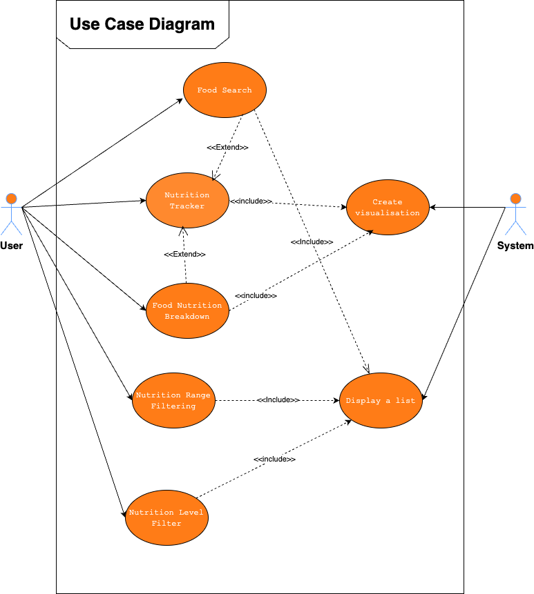
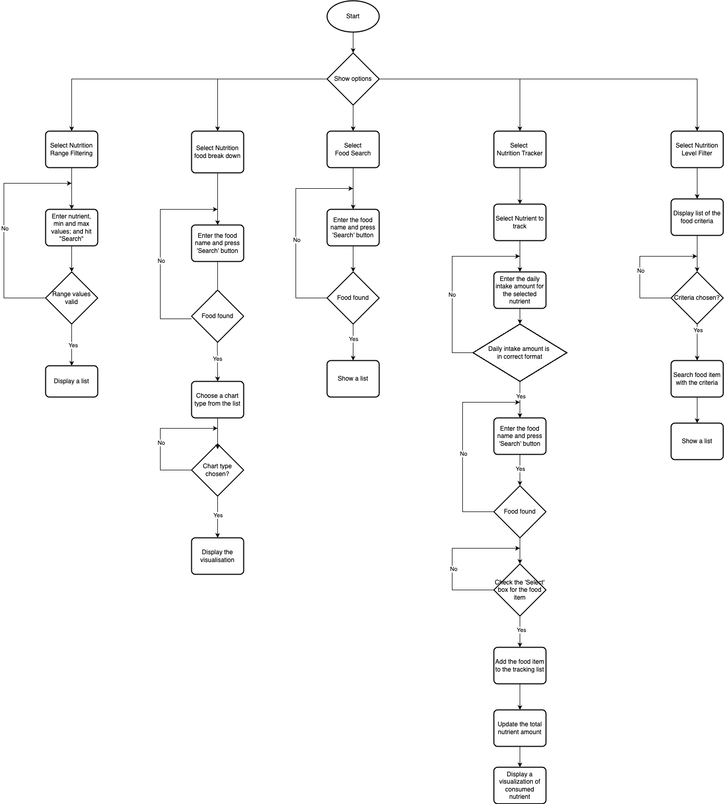
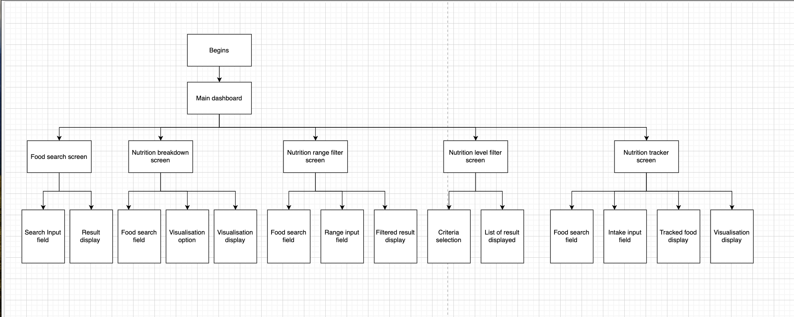
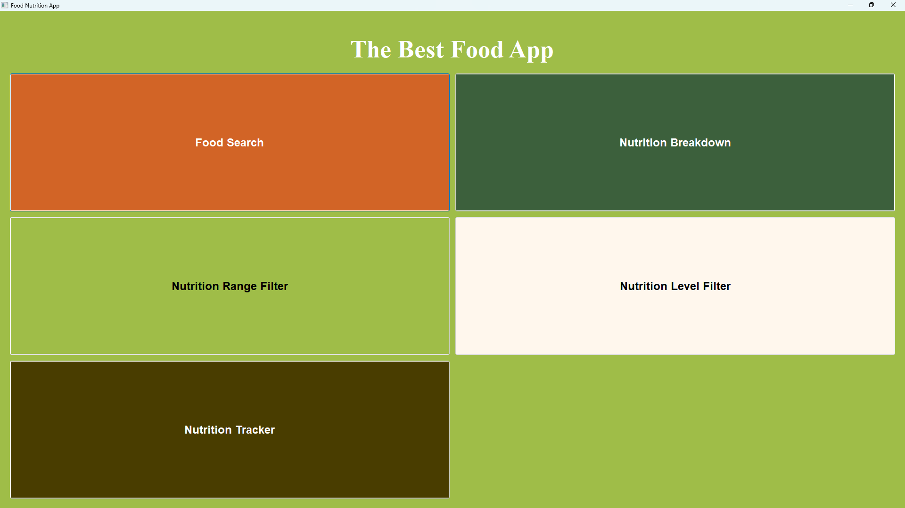
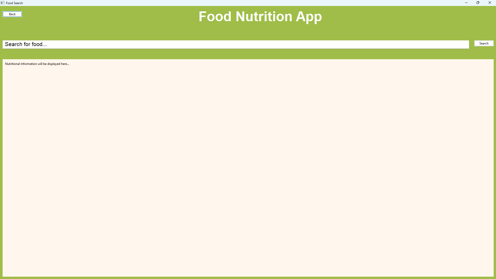
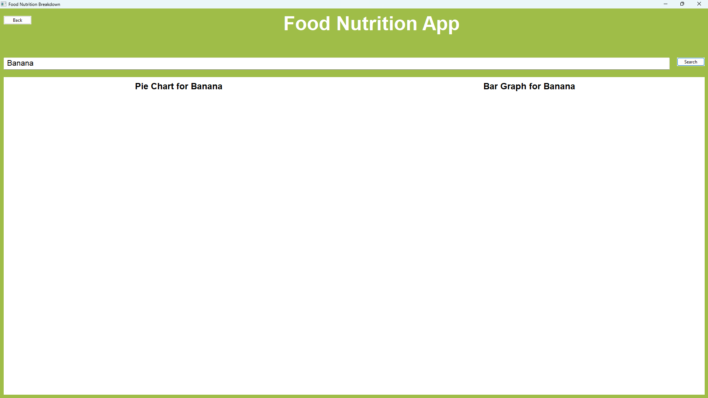
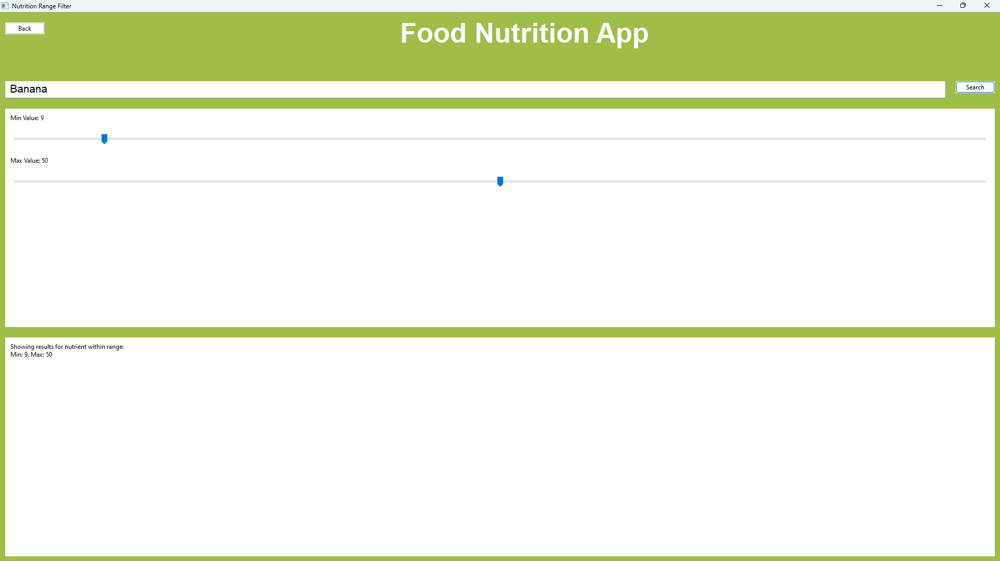
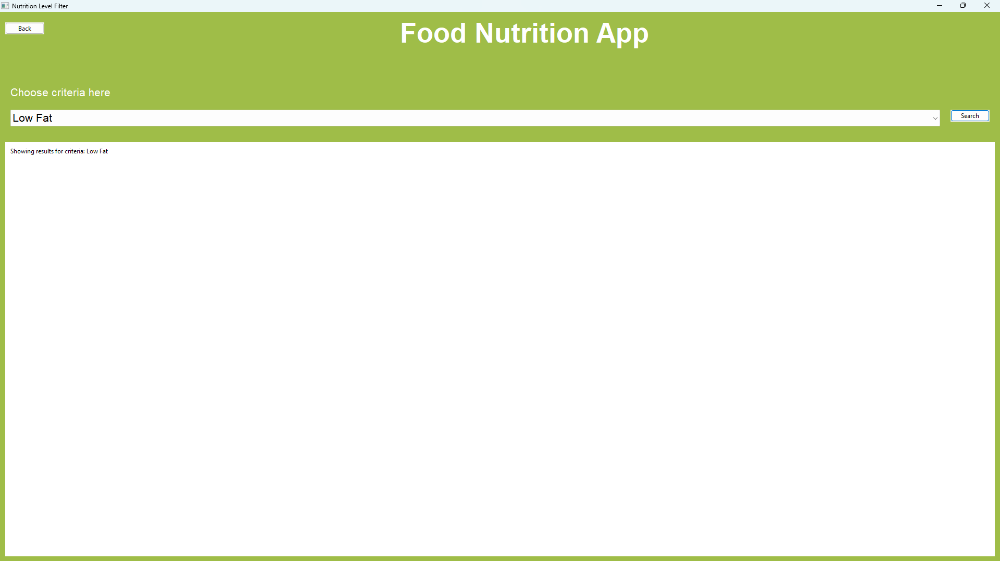
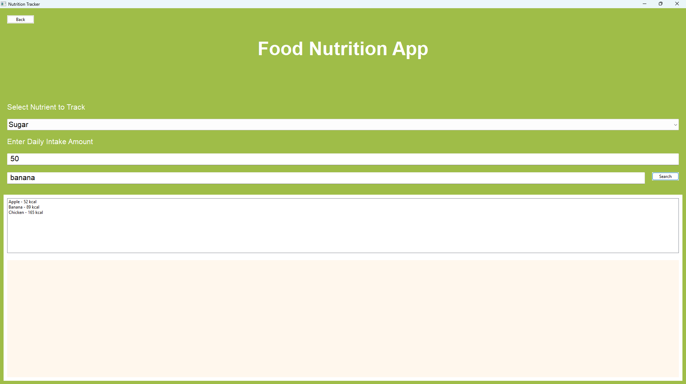

# Software Design Document

## Project Name: Nutrition analysis and tracking app
## Group Number: 001

## Team members

| Student Number | Name      |
|----------------|-----------|
| s5373168       | Suhyun Kim |
| s5292413       | Vincent To |
| s5384131       | Huyen Trang Vu |

# Table of Contents

<!-- TOC -->
* [Table of Contents](#table-of-contents)
 * [1. System Vision](#1-system-vision)
   * [1.1 Problem Background](#11-problem-background)
   * [1.2 System capabilities/overview](#12-system-capabilitiesoverview)
   * [1.3  Potential Benefits](#13potential-benefits)
 * [2. Requirements](#2-requirements)
   * [2.1 User Requirements](#21-user-requirements)
   * [2.2  Software Requirements](#22software-requirements)
   * [2.3 Use Case Diagrams](#23-use-case-diagrams)
   * [2.4 Use Cases](#24-use-cases)
 * [3. Software Design and System Components](#3-software-design-and-system-components-)
   * [3.1  Software Design](#31software-design)
   * [3.2  System Components](#32system-components)
     * [3.2.1 Functions](#321-functions)
     * [3.2.2 Data Structures / Data Sources](#322-data-structures--data-sources)
     * [3.2.3 Detailed Design](#323-detailed-design)
 * [4. User Interface Design](#4-user-interface-design)
   * [4.1 Structural Design](#41-structural-design)
   * [4.2  Visual Design](#42visual-design)
<!-- TOC -->

## 1. System Vision

### 1.1 Problem Background

- Problem Identification: The system should enable users to search for food items, retrieve detailed nutrition information, and filter the data based on specific nutritional criteria by providing a graphical user interface and data visualization. 
- Dataset: Nutritional Food Dataset
- Data Input/Output: 
Input 
Name of the food
User selection of the food, nutrition and nutritional content levels 
Minimum & maximum values of nutrition
Output
Display of nutritional information
Pie charts and bar graphs of nutrient breakdown
A list of foods that fall within the ranges users set

- Target Users: 
Individuals who are health conscious to track their nutritions.
Nutritionist/ dietitian to provide nutrition information to their clients.
People with dietary restriction: to avoid certain ingredients while maintaining a balanced diet.
Culinary professionals for example chefs, cooks to cater dietary requirements of their clients.
Researcher: individuals who study nutrition, food science, or health-related fields, they need a tool for accessing detailed nutritional data and visualizing trends in food items for academic research or educational purposes.

### 1.2 System capabilities/overview

- System Functionality: System will accept user inputs, such as the name of the food or a specified range of nutritional data, and retrieve the results with a visual representation of the information.
- Features and Functionalities: 
Food Search: Allow users to search for food using a search bar, display results and nutritional information for individual food.
Nutrition Breakdown: Allow users to view and choose food from a list, and graphically demonstrate the nutrient breakdown using pie charts and bar graphs.
Nutrition Range Filter: Allow users to select a range of nutritional value, and provide a list of food that has the nutritional value within the range.
Nutrition Level Filter: For example, if the highest amount of fat among all foods is 30 grams, then foods with less than 10 grams of fat would be considered "low" in fat content. The system will convert all the food content into high, mid or low in nutrient content (eg: coffee high in sugar, low in calories, mid in carb, etc), system then allow user to filter food base on nutritional content level (eg user filter food which low in sugar, low in calories and low in carbs). 
Nutrition Tracker: Allow users to select foods and check how much a specific nutrient contributes based on the quantity they input and display it via pie charts. For example: if a user wants to track their daily sugar intake, they can input their recommended amount (e.g., 100g) and select foods. The system will display the sugar content of the selected food (e.g., 24g from coffee) as a percentage of the recommended intake, shown in a pie chart (e.g., 24g out of 100g). 

### 1.3 Benefit Analysis

How will this system provide value or benefit?
Better Health Decisions: Users can access detailed nutritional information to optimize their diet and achieve health goals, such as weight loss or improved fitness.
Personalized nutrition:  The system helps users filter foods by nutritional criteria, supporting specific diets (e.g., low-carb, gluten-free).
Time efficiency: the system simplifies the search for nutritional data, saving users time on meal planning.
Data insight: Visualization tools help users quickly compare and analyze nutritional information for better decision-making.

## 2. Requirements

### 2.1 User Requirements

An user who follows a personalized meal plan to support his goal of building muscle while maintaining a balanced diet. He uses the system to find foods that meet his daily macronutrient goals, track his calorie intake, and ensure his meals are nutritionally sound. Customer first logs into the system where there is search functionality allowing the user to search for a specific food (eg: chicken breast, etc). Upon searching, the user sees detailed nutritional information, including calories, protein, fat, carbohydrates, and vitamins. He can filter these results based on his dietary needs, such as "high protein" or "low carb," and visualize the nutritional data in an easy-to-read format, helping him compare options. When a user selects food items, the system stores them in his daily log, allowing him to track his intake over time. The data visualization tools also help him monitor his progress towards meeting his macronutrient goals for the day.
Functionality user must provide:
Search functionality: users need to search for food items by name or category, the system must display detailed nutritional information, including macronutrients and vitamins, in a readable format.

### 2.2 Software Requirements

- R1.1 The program will accept the food name as text input from the user and search the database for matching results.
- R1.2 The program will show the nutritional data of the matching result as a list, showing both the nutrient names and their values.

- R2.1 The program will accept the user’s selection of food from the list as input. 
- R2.2 The program generates and displays pie charts and bar charts showing the nutrient content of the food.

- R3.1 The program will accept the user’s input for a range of nutritional values.
- R3.2 The program will search for all foods with nutritional values within the specified range and display them in a list.

- R4.1: The program will accept the user’s filter input as text(e.g. high protein, low fat, low sodium).
-R4.2: The program will refine the list of food items displayed based on the user's specific criteria. 

-R5.1: The program will accept user’s input for recommended daily intake values for a specific nutrition (eg: sugar, protein, sodium).
-R5.2: The program will display the percentage of the nutrient consumed relative to the user’s target intake in a pie chart.

### 2.3 Use Case Diagram
Provide a system-level Use Case Diagram illustrating all required features.

Example: 

### 2.4 Use Cases
Include at least 5 use cases, each corresponding to a specific function.

| Use Case ID    | UC-01|
|----------------|------|
| Use Case Name  | Food Search |
| Actors         | Users |
| Description    | The user searches for nutritional information by entering a food name. The system processes the input and returns relevant nutritional data if available. |
| Flow of Events | 1. The user selects the ‘Search Food’ option. 
2. The user enters the food name in the text field and presses ‘Search’ button.
3. The system searches for foods that match the entered string.
4. If a match is found, the system retrieves and displays the nutritional data.
5. The system lists the nutritional information for the food.
| Alternate Flow | If no matching food is found, the system notifies the user with a message ‘No food found’.|

| Use Case ID    | UC-02|  
|----------------|------|
| Use Case Name  | food nutrition breakdown|
| Actors         | Users |
| Description    | The user selects one food item by entering the food name in a text field and the system generates and displays pie charts and bar charts that illustrate the nutrient content of the selected food items.|
| Flow of Events | 1. The user selects one food item by entering the food name in the text field.
The system retrieves the nutrient content data for the selected food items.
The system generates a pie chart showing the percentage distribution of various nutrients in the selected food.
The system generates a bar chart showing the quantity of specific nutrients in the selected food.
5. The system displays the pie chart and bar chart to the user |
| Alternate Flow | AF1: If the user selects a food item not recognized by the system, an error message is displayed, and the user is prompted to select another item.
AF2: If the user does not make a selection and tries to proceed, the system prompts the user to select at least one food item.
 |

| Use Case ID    | UC-03 |
|----------------|------|
| Use Case Name | Nutrition Range Filtering |
| Actors         | Users |
| Description    | Users select the nutrition range and the system provides a list of foods that have that nutrition value within the chosen range |
| Flow of Events | 1. The user selects “Nutrition Range Filter”
2. The system shows a list of nutrition
3. The user selects one from the list
4. The system displays a “Min value” and a “Max value” boxes
5. The user inputs min & max values and confirm
6. The system displays a list of foods that meet the requirements|
| Alternate Flow | If no food meets the requirements, the system notifies the user and asks if the user wants to adjust the range |

| Use Case ID    | UC-04  |
|----------------|------|
| Use Case Name  | Nutrition Level Filter|
| Actors         | Users |
| Description    |The user chooses specific dietary criteria from the drop down box(e.g., "high protein," "low fat," "low sodium"). The system refines the displayed list of food items based on the user's filter input, showing only those items that meet the specified criteria.|
| Flow of Events | 1.The system displays a list of dietary criteria (e.g., "high protein," "low fat").
2.The user chooses the desired criteria from the drop down box.
3.The system processes the input and applies the specified filters to the list of food items.
4.The system refines the list of food items to include only those that match the user's criteria.
5.The system displays the refined list of food items to the user.|
| Alternate Flow |
AF1: If no food items meet the specified criteria, the system informs the user and provides options to adjust the filter or clear the filter.|

| Use Case ID    | UC-05  |
|----------------|------|
| Use Case Name  | Nutrition Tracker |
| Actors         | Users |
| Description    | The user tracks total consumption of specific nutrients by selecting nutrients to monitor and adding the food items to a tracking list. |
| Flow of Events | 1. The user selects a nutrient from the dropdown menu.
2. The user enters the daily intake amount for the selected nutrient.
3. The user searches for a food item using the text field.
4. The system finds and matches food items based on the entered text.
5. If found, the system displays the food item with a ‘Select’ checkbox option.
6. The user checks the box to select the food item, adding it to the tracking list.
7. The system updates the total nutrient amount based on the selected food items.
8. The system displays a pie chart showing the percentage of each nutrient consumed relative to the daily intake amount. |
| Alternate Flow | - If no matching food is found, the system displays the message ‘No food found’. 
- If the total nutrient amount exceeds the daily intake, the system shows a message indicating ‘Over the recommended intake’.|

| Use Case ID    | UC-06|
|----------------|------|
| Use Case Name  | Display a list |
| Actors         | System |
| Description    | The system searches for the matching food item based on the criteria and displays a list of the nutrients associated with that food item. |
| Flow of Events | 1. The system identifies food names.
2. The system identifies criteria and applies the filter criteria if the user has set any.
3. The system displays the list of nutrients.
| Alternate Flow | If no matching food is found, the system notifies the user with a message ‘No food found’.|

| Use Case ID    | UC-07  |
|----------------|------|
| Use Case Name  | Create visualization|
| Actors         | System |
| Description    |The system display visualization such as bar chart or pie chart according to the user’s criteria|
 Flow of Events | 1. The system retrieves the criteria and processes the data.
2.Base on user’s selection, the system selects the appropriate visualization eg: bar chart or pie chart.
3. The system generates and displays the visualization.|
| Alternate Flow | If no food matches the criteria, an error message will be displayed.|
## 3. Software Design and System Components

### 3.1 Software Design
Include a flowchart that illustrates how your software will operate.

Example: 

### 3.2 System Components

#### 3.2.1 Functions
List all key functions within the software. For each function, provide:
- Description: Brief explanation of the function’s purpose.
- Input Parameters: List parameters, their data types, and their use.
- Return Value: Describe what the function returns.
- Side Effects: Note any side effects, such as changes to global variables or data passed by reference.

searchFood
Description : This function takes the name of the food as string as an input and the data. It searches the row that has a matching food name and returns the row. If nothing is found, it returns False.
Input Parameters : food_name(str), data(dataFrame)
Return Value : the row of the matching food
Side Effects : No side effects
getNutrientInfo
Description : This function takes dataFrame type of data (one row) and separates the nutrients name and nutrients value into the lists.
Input parameters : data(dataFrame)
Return Value : nutrients_name(list), nutrients_values(list)
Side Effects : No side effects
displayChart
Description :This function takes the value input and displays the chart based on the user's input (1 for pie chart, 2 for bar chart). 
If the amount of nutrients is less than 5%, they are combined into the ‘others’ category.
Input parameters : graphOption(int), data(dataFrame)
Return Value : Return nothing
Side Effects : No side effects
rangeFilterFood
Description: This function takes the name of the nutrient, min and max value of the nutrition as inputs. It then searches for the food name and returns a list of food names, and name of the nutrient selected with its value that matches the range.  If nothing is found, it returns False.
Input parameters: nutrient(str), min_value(float), max_value(float), data(dataFrame)
Return Value : the set of rows of the filtered food (dataFrame type)
Side Effects : No side effects
displayList
Description : This function takes in rows of filtered food as inputs, it then makes a list of food names. 
Input parameters : data(dataFrame)
Return Value : Return nothing
Side Effects : No side effects
levelFilterFood
Description: This function takes in the nutrition name and its level as a string (e.g., ‘Low’, ‘Mid’, or ‘High’). It then sorts those values in ascending order.
Input parameters : level(str), nutrient(str), data(dataFrame)
Return Value: the set of rows of the filtered food (dataFrame type)
Side Effects: No side effects
updateDailyIntake
Description: This function takes in the nutrient value and updates then returns the updated nutrient value.
Input Parameter : nutrient_value(float), intake_nutrient(float)
Return Values: updated_nutrient_value(float)
Side Effects: No side effects

#### 3.2.2 Data Structures / Data Sources
List all data structures or sources used in the software. For each, provide:
list
Usage: store the nutrient names, nutrient values or food names for displaying the list to the users 
Functions: getNutrientInfo, displayList
string
Usage: used to take inputs from users.
Functions: searchFood, rangeFilterFood, levelFilterFood
float
Usage: store decimal nutrient values.
Functions:rangeFilterFood, updateDailyIntake.
dataFrame
Usage: store the filtered or searched data from the whole data and used for visualization
Functions: searchFood, displayChart, levelFilterFood
int
Usage: store the type of graph as an integer (e.g., pie = 1, bar = 2) and used for visualization
Functions: display chart

#### 3.2.3 Detailed Design

def searchFood(food_name, data) :
	matching_row <- data[data.food is food_name]
	if matching_row is empty
		then return False
	else 
		return matching_row

def getNutrientInfo(data) :
nutrients_name <- list(foodname.columns)
nutrients_value <- foodname.values[0]
	return nutrients_name, nutrients_value

def displayChart(graphOption, data) :
	group nutrients with amounts less than 5% into an 'Others' category
	if graphOption is pie :
		then create pie chart
	else if graphOptions is bar :
		then create bar char

def rangeFilterFood(nutrient, min_value, max_value, data) :
	filtered_row <- data[data.nutrient >= min_value and data.nutrient<=max_value]
	if filtered_row is empty :
		then return False
	else :
		then return filtered_row

def displayList(data) :
	separate data into food names and its nutrition data
	display these two lists

def levelFilterFood(level, nutrient, data) :
	sorted_data = data.sort(by nutrient with ascending order)
	highest_val_of_low <- sorted_data[data.length * 0.33]
	highest_val_of_mid <- sorted_data[data.length * 0.66]
	pct_75 = data.length * 0.75
	if level is Low :
		then return sorted_data[sorted_data.nutrient<highest_val_of_low]
	else if level is Mid :
		then return sorted_data[sorted_data.nutrient>=highest_val_of_low and 		sorted_data.nutrient<highest_val_of_mid]
	else if level is High :
		then return sorted_data[sorted_data.nutrient>highest_val_of_mid]

def updateDailyIntake(nutrient_value, intake_nutrient) :
	updated_nutrient_value = nutrient_value + intake_nutrient
	return updated_nutrient_value

.
## 4. User Interface Design
### 4.1 Structural Design

The software system is organized into the following main components:
1.Main Dashboard
Purpose: Central hub from which users can access all system features.
Sub-components:
Navigation Menu (for quick access to different functionalities)
2. Food Search Function
Purpose: Allows users to search for specific food items and view detailed nutritional information.
Sub-components:
Search Input Field
Results Display
Food Details Panel (with nutritional information)
Error Handling (e.g., “No food found” message)
3. Nutritional breakdown
Purpose: Provides a visual representation of the nutrient content of selected food items.
Sub-components:
Food Selection Panel
Visualization Options (Pie Chart, Bar Chart)
Visualization Display (charts showing nutrient breakdown)
Error Handling (e.g., “Food not recognized” message)
4. Nutrition range filter
Purpose:  Allows users to filter foods based on a specific range of nutritional values.
Sub-components:
Nutrition Selection Panel
Range Input Fields (Min and Max values)
Filtered Results Display
Error Handling (e.g., “No food meets the requirements” message)
5. Nutrition level filter
Purpose: Filters foods based on specific nutritional levels (e.g., high protein, low fat).
Sub-components:
Criteria Selection (from drop-down menu)
Filtered Results Display
Error Handling (e.g., “No food matches the criteria” message).
6. Nutrition tracker module
Purpose: Tracks user’s daily intake of specific nutrients and visualizes the progress.
Sub-components:
Nutrient Selection Panel
Intake Input Field
Tracked Foods Display
Visualization Display (Pie Chart showing intake progress)
Error Handling (e.g., “Over the recommended intake” message)

### 4.2 Visual Design
The application includes 6 screens: 1 landing screen, shown to the users when they first open the app, and 5 other screens for 5 different functions. The interfaces were designed using the User Centred Design (UCD) method to maximise the usability of the application. Comprehensive buttons and layouts have been used to make it easier for users to interact with the system. All the screens (except the landing screen) include a “Back” button on the top-left corner to let users navigate to the landing screen (menu). The system also uses “Search” buttons and value sliders, which are user-friendly conventions. The text fonts and sizes are also considered to maintain the visibility of all the system components. This design also includes colours. These colours follow a consistent palette to ensure the theme colour of a healthy food app.

Example: 
Landing Screen

Food Search Screen

Nutrition Breakdown Screen

Nutrition Range Filter Screen

Nutrition Level Filter Screen

Nutrition Tracker Screen
