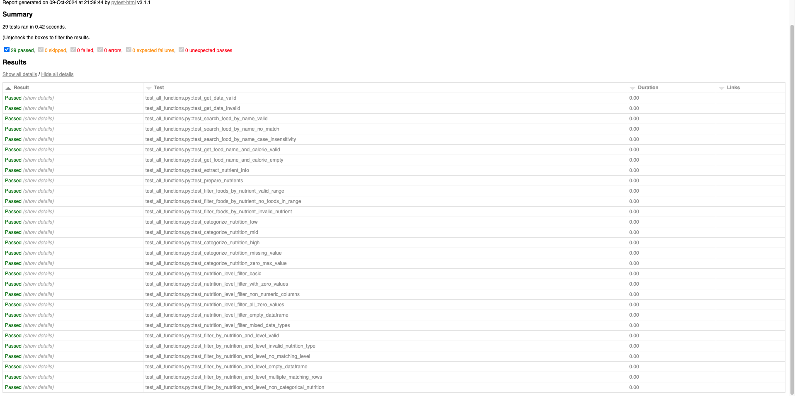

# Unit Testing Report

Please provide your GitHub repository link.
### GitHub Repository URL: https://github.com/SuhyunKimm/Milestone1_Group001

---

The testing report should focus solely on <span style="color:red"> testing all the self-defined functions related to 
the five required features.</span> There is no need to test the GUI components. Therefore, it is essential to decouple your code and separate the logic from the GUI-related code.


## 1. **Test Summary**
list all tested functions related to the five required features and the corresponding test functions designed to test 
those functions, for example:

| **Tested Functions** | **Test Functions**                                                                                                                                                                                          |
|-----------------|-------------------------------------------------------------------------------------------------------------------------------------------------------------------------------------------------------------|
| `get_data(path)` | `test_get_data_valid()` <br> `test_get_data_invalid()`                                                                                                                                                      |
| `search_food_by_name(df, name)`| `test_search_food_by_name_valid()` <br> `test_search_food_by_name_no_match()` <br>  `test_search_food_by_name_case_insensitivity` <br> `test_get_food_name_and_calorie_valid`                               |
| `get_food_name_and_calorie(df)` | `test_get_food_name_and_calorie_empty()`                                                                                                                                                                    
 `categorize_nutrition(value, max_value)` | `test_categorize_nutrition_low()` <br> `test_categorize_nutrition_mid()` br `test_categorize_nutrition_high()`br `test_categorize_nutrition_missing_value()`br `test_categorize_nutrition_zero_max_value()` |<br/>
| `nutrition_level_filter(df)` | `test_nutrition_level_filter_basic` <br> `test_nutrition_level_filter_with_zero_values()` <br> `test_nutrition_level_filter_non_numeric_columns()` br `test_nutrition_level_filter_all_zero_values()` br `test_nutrition_level_filter_empty_dataframe()` r `test_nutrition_level_filter_mixed_data_types()` 
| `filter_by_nutrition_and_level` |`test_filter_by_nutrition_and_level_valid()` <br> `test_filter_by_nutrition_and_level_invalid_nutrition_type()` <br> `test_filter_by_nutrition_and_level_no_matching_level()` br `test_filter_by_nutrition_and_level_empty_dataframe()` br `test_filter_by_nutrition_and_level_multiple_matching_rows()` br `test_filter_by_nutrition_and_level_non_categorical_nutrition()`                                                                                                                                                                   
|

---

## 2. **Test Case Details**

### Test Case 1:
- **Test Function/Module**
  - `test_get_data_valid()`
  - `test_get_data_invalid()`
- **Tested Function/Module**
  - `get_data(path)`
- **Description**
  - The testing functions are designed to verify that the `get_data` function successfully loads CSV data from a specified path and ensures that the file adheres to the expected format.

- **1) Valid Input and Expected Output**  

| **Valid Input**          | **Expected Output** |
|--------------------------|---------------------|
| `get_data('Food_Nutrition_Dataset.csv')`             | DataFrame type data |


- **1) Code for the Test Function**
```python
def test_get_data_valid() :
    filepath = 'Food_Nutrition_Dataset.csv'
    file = get_data(filepath)
    assert isinstance(file, pd.DataFrame)
```
- **2) Invalid Input and Expected Output**

| **Invalid Input**              | **Expected Output** |
|--------------------------------|---------------------|
| `get_data('invalid_path.csv')` | `FileNotFoundError` |

- **2) Code for the Test Function**
```python
def test_get_data_invalid():
    filepath = 'invalid_path.csv'  # An intentionally invalid path
    with pytest.raises(FileNotFoundError):
        get_data(filepath)
```
### Test Case 2:
- **Test Function/Module**
  - `test_search_food_by_name_valid()`
  - `test_search_food_by_name_no_match()`
  - `test_search_food_by_name_case_insensitivity()`
- **Tested Function/Module**
  - `search_food_by_name(df, name)`
- **Description**
  - The testing functions are designed to confirm that the `search_food_by_name` function accurately retrieves data with matching names in a case-insensitive manner.
- **1) Valid Input and Expected Output**  

| **Valid Input**                              | **Expected Output**                                                            |
|----------------------------------------------|--------------------------------------------------------------------------------|
| `search_food_by_name(sample_data, 'melone')` | `pd.DataFrame({'food' : ['Watermelon', 'melon'], 'Caloric Value' : [62, 82]})` |
| `search_food_by_name(sample_data, 'apple')`  | `pd.DataFrame({'food' : ['Apple', 'Pineapple'],'Caloric Value' : [95, 105]})`  |

- **1) Code for the Test Function**
```python
def test_search_food_by_name_valid():
    sample_data = pd.DataFrame({
        'food': ['Apple', 'Pineapple', 'Watermelon', 'melon', 'Oranges'],
        'Caloric Value': [95, 105, 62, 82, 62]
    })
    result1 = search_food_by_name(sample_data, 'melon').reset_index(drop=True)
    expected1 = pd.DataFrame({
        'food': ['Watermelon', 'melon'],
        'Caloric Value': [62, 82]
    })

    assert isinstance(result1, pd.DataFrame)
    assert result1.equals(expected1)
    
    result2 = search_food_by_name(sample_data, 'apple').reset_index(drop=True)
    expected2 = pd.DataFrame({
        'food' : ['Apple', 'Pineapple'],
        'Caloric Value' : [95, 105]
    })

    assert isinstance(result2, pd.DataFrame)
    assert result2.equals(expected2)
```
- **2) Invalid Input and Expected Output (Not Matching)**

| **Invalid Input**             | **Expected Output** |
|-------------------------------|--------------------|
| `search_food_by_name(sample_data, 'Mango')`| empty  |

- **2) Code for the Test Function**
```python
def test_search_food_by_name_no_match():
    sample_data = pd.DataFrame({
        'food': ['Apple', 'Pineapple', 'Watermelon', 'melon', 'Oranges'],
        'Caloric Value': [95, 105, 62, 82, 62]
    })
    result = search_food_by_name(sample_data, 'Mango')
    assert result.empty
```
- **3) Valid Input and Expected Output (Case Insensitivity)**

| **Invalid Input**                             | **Expected Output** |
|-----------------------------------------------|--------------------|
| `search_food_by_name(sample_data, 'oRaNgEs')` | `pd.DataFrame({'food': ['Oranges'],'Caloric Value': [62]})`  |
| `search_food_by_name(sample_data, 'MeLoN')`   | `pd.DataFrame({'food': ['Watermelon', 'melon'],'Caloric Value': [62,82]})`  |

- **2) Code for the Test Function**
```python
def test_search_food_by_name_case_insensitivity():
    sample_data = pd.DataFrame({
        'food': ['Apple', 'Pineapple', 'Watermelon', 'melon', 'Oranges'],
        'Caloric Value': [95, 105, 62, 82, 62]
    })
    result1 = search_food_by_name(sample_data, 'oRaNgEs').reset_index(drop=True)
    expected1 = pd.DataFrame({
        'food': ['Oranges'],
        'Caloric Value': [62]
    })

    assert isinstance(result1, pd.DataFrame)
    assert result1.equals(expected1)

    result2 = search_food_by_name(sample_data, 'MeLoN').reset_index(drop=True)
    expected2 = pd.DataFrame({
        'food': ['Watermelon', 'melon'],
        'Caloric Value': [62,82]
    })

    assert isinstance(result2, pd.DataFrame)
    assert result2.equals(expected2)
```
### Test Case 3:
- **Test Function/Module**
  - `test_get_food_name_and_calorie_valid()`
  - `test_get_food_name_and_calorie_empty()`
- **Tested Function/Module**
  - `get_food_name_and_calorie(df)`
- **Description**
  - The testing functions are designed to ensure that the `get_food_name_and_calorie` function successfully generates a list of strings, each containing a food name along with its caloric value.
- **1) Valid Input and Expected Output**  

| **Valid Input**               | **Expected Output** |
|-------------------------------|---------------------|
| `get_food_name_and_calorie(sample_data)` | `['Apple (95 kcal)', 'Pineapple (105 kcal)', 'Watermelon (62 kcal)', 'melon (82 kcal)', 'Oranges (62 kcal)']`                 |

- **1) Code for the Test Function**
```python
def test_get_food_name_and_calorie_valid():
    sample_data = pd.DataFrame({
        'food': ['Apple', 'Pineapple', 'Watermelon', 'melon', 'Oranges'],
        'Caloric Value': [95, 105, 62, 82, 62]
    })
    result = get_food_name_and_calorie(sample_data)
    expected = ['Apple (95 kcal)', 'Pineapple (105 kcal)', 'Watermelon (62 kcal)', 'melon (82 kcal)', 'Oranges (62 kcal)']

    assert result == expected
```
- **2) Invalid Input and Expected Output (Empty dataframe)**

| **Invalid Input**             | **Expected Output** |
|-------------------------------|---------------------|
| `get_food_name_and_calorie(empty_df)` | empty list `[]`      |

- **2) Code for the Test Function**
```python
def test_get_food_name_and_calorie_empty():
    empty_df = pd.DataFrame(columns = ['food', 'Caloric Value'])
    result = get_food_name_and_calorie(empty_df)
    expected = []

    assert result == expected
```

### Test Case 4:
- **Test Function/Module**
  - `test_categorize_nutrition_low()` 
  - `test_categorize_nutrition_mid()` 
  - `test_categorize_nutrition_high()`
  - `test_categorize_nutrition_missing_value()`
  - `test_categorize_nutrition_zero_max_value()`
 
- **Tested Function/Module**
  - `categorize_nutrition(value, max_value)`
- **Description**
  - A testing function to ensure that that the `categorize_nutrition(value, max_value)` successfully take in a value and a max value and categorise the value into mid, low or high

- **1) Valid Input and Expected Output**  

| **Valid Input**                  | **Expected Output** |
|----------------------------------|---------------------|
| `categorize_nutrition(5, 30)`    | `low`               |
| `categorize_nutrition(15, 30)`   | `mid`               |
| `categorize_nutrition(25, 30)`   | `high`              |
| `categorize_nutrition( nan, 30)` | `unknow`            |
| `categorize_nutrition(0, 0)`     | `high`              |

- **1) Code for the Test Function**
```python
def test_categorize_nutrition_low():
    assert categorize_nutrition(5, 30) == 'low'

def test_categorize_nutrition_mid():
    assert categorize_nutrition(15, 30) == 'mid'

def test_categorize_nutrition_high():
    assert categorize_nutrition(25, 30) == 'high'

def test_categorize_nutrition_missing_value():
    assert categorize_nutrition(float('nan'), 30) == 'unknown'

def test_categorize_nutrition_zero_max_value():
    assert categorize_nutrition(0, 0) == 'high'  # Edge case handling

```


### Test Case 5:
- **Test Function/Module**
  - `test_nutrition_level_filter_basic` 
  - `test_nutrition_level_filter_with_zero_values()` 
  - `test_nutrition_level_filter_non_numeric_columns()`
  - `test_nutrition_level_filter_all_zero_values()` 
  - `test_nutrition_level_filter_empty_dataframe()` 
  - `test_nutrition_level_filter_mixed_data_types()` 

- **Tested Function/Module**
  - `nutrition_level_filter(df)`
- **Description**
  - The nutrition_level_filter function categorizes numeric nutritional values in a DataFrame into levels like "low," "mid," and "high" based on their relative size compared to the maximum value in each column, excluding the "food" column.
- **1) Valid Input and Expected Output**  

| **Valid Input**                  | **Expected Output** |
|----------------------------------|-------------|
| `test_nutrition_level_filter_basic` | `pd.DataFrame({ "food": ["apple", "banana", "carrot”],”calories": [40, 90, 150],"sugar": [8, 15, 30]})`          |
| `test_nutrition_level_filter_with_zero_values()` | `pd.DataFrame({"food": ["apple", "banana", "carrot"],"calories": ["low", "mid", "high"],"sugar": ["low", "low", "high"})`          |
| `test_nutrition_level_filter_non_numeric_columns()` | `pd.DataFrame({"food": ["apple", "banana", "carrot"],"calories": ["low", "mid", "high"],"description": ["tasty", "yellow", "crunchy"]})`        |
| `test_nutrition_level_filter_all_zero_values()` | `pd.DataFrame({"food": ["apple", "banana", "carrot"],"calories": ["high", "high", "high"],"sugar": ["high", "high", "high"]})`        |
| `test_nutrition_level_filter_empty_dataframe()` | `pd.DataFrame(columns=["food", "calories", "sugar"])`       |
| `test_nutrition_level_filter_mixed_data_types()` | `pd.DataFrame({"food": ["apple", "banana", "carrot"],"calories": ["low", "mid", "high"],"sugar": ["10", "20", "30"]})`        |


- **1) Code for the Test Function**
```python
def test_nutrition_level_filter_basic():
    df = pd.DataFrame({
        "food": ["apple", "banana", "carrot"],
        "calories": [40, 90, 150],
        "sugar": [8, 15, 30]
    })
    result = nutrition_level_filter(df)

    expected = pd.DataFrame({
        "food": ["apple", "banana", "carrot"],
        "calories": ["low", "mid", "high"],
        "sugar": ["low", "mid", "high"]
    })
    pd.testing.assert_frame_equal(result, expected)


def test_nutrition_level_filter_with_zero_values():
    df = pd.DataFrame({
        "food": ["apple", "banana", "carrot"],
        "calories": [0, 50, 100],
        "sugar": [0, 0, 30]
    })
    result = nutrition_level_filter(df)

    expected = pd.DataFrame({
        "food": ["apple", "banana", "carrot"],
        "calories": ["low", "mid", "high"],
        "sugar": ["low", "low", "high"]
    })
    pd.testing.assert_frame_equal(result, expected)


def test_nutrition_level_filter_non_numeric_columns():
    df = pd.DataFrame({
        "food": ["apple", "banana", "carrot"],
        "calories": [40, 90, 150],
        "description": ["tasty", "yellow", "crunchy"]
    })
    result = nutrition_level_filter(df)

    expected = pd.DataFrame({
        "food": ["apple", "banana", "carrot"],
        "calories": ["low", "mid", "high"],
        "description": ["tasty", "yellow", "crunchy"]
    })
    pd.testing.assert_frame_equal(result, expected)


def test_nutrition_level_filter_all_zero_values():
    df = pd.DataFrame({
        "food": ["apple", "banana", "carrot"],
        "calories": [0, 0, 0],
        "sugar": [0, 0, 0]
    })
    result = nutrition_level_filter(df)

    expected = pd.DataFrame({
        "food": ["apple", "banana", "carrot"],
        "calories": ["high", "high", "high"],
        "sugar": ["high", "high", "high"]
    })
    pd.testing.assert_frame_equal(result, expected)


def test_nutrition_level_filter_empty_dataframe():
    df = pd.DataFrame(columns=["food", "calories", "sugar"])
    result = nutrition_level_filter(df)

    expected = pd.DataFrame(columns=["food", "calories", "sugar"])
    pd.testing.assert_frame_equal(result, expected)


def test_nutrition_level_filter_mixed_data_types():
    df = pd.DataFrame({
        "food": ["apple", "banana", "carrot"],
        "calories": [40, 90, 150],
        "sugar": ["10", "20", "30"]  # sugar values are strings
    })
    result = nutrition_level_filter(df)

    expected = pd.DataFrame({
        "food": ["apple", "banana", "carrot"],
        "calories": ["low", "mid", "high"],
        "sugar": ["10", "20", "30"]
    })
    pd.testing.assert_frame_equal(result, expected)
```
- **2) Invalid Input and Expected Output**

| **Invalid Input**             | **Expected Output** |
|-------------------------------|---------------------|
| `divide(10, 0)`               | `Handle Exception`  |
| `add more cases in necessary` | `...`               |

- **2) Code for the Test Function**
```python
def test_divide_invalid():
    with pytest.raises(ValueError) as exc_info:
        divide(10, 0)
    assert exc_info.type is ValueError
```

### Test Case 6:

- **Test Function/Module**
  - `test_filter_by_nutrition_and_level_valid()` 
  - `test_filter_by_nutrition_and_level_invalid_nutrition_type()` 
  - `test_filter_by_nutrition_and_level_no_matching_level()`
  - `test_filter_by_nutrition_and_level_empty_dataframe()` 
  -  `test_filter_by_nutrition_and_level_multiple_matching_rows()` 
  - `test_filter_by_nutrition_and_level_non_categorical_nutrition()` 

- **Tested Function/Module**
  - `filter_by_nutrition_and_level(df,nutrition_type, desired_level)`
- **Description**
  - The filter_by_nutrition_and_level function filters a DataFrame to find foods that match a specified nutrition type and level (e.g., "low," "mid," "high"), returning a filtered DataFrame or an appropriate message if no matches are found.
- **1) Valid Input and Expected Output**  

| **Valid Input**                                   | **Expected Output** |
|---------------------------------------------------|-----------------|
| `test_filter_by_nutrition_and_level_valid() `             |   `pd.DataFrame({'food': ['Pineapple'],'Caloric Value': [50]})`                |
| `test_filter_by_nutrition_and_level_multiple_matching_rows()`     | `pd.DataFrame({"food": ["banana", "grapes"],"calories": [80, 70]})`            |
| `test_filter_by_nutrition_and_level_non_categorical_nutrition()`   | `pd.DataFrame({"food": ["apple"],“sugar": [8]})`              |


- **1) Code for the Test Function**
```python
def test_filter_by_nutrition_and_level_valid():
    # Sample data for testing
    sample_data = pd.DataFrame({
        'food': ['Apple', 'Pineapple', 'Watermelon'],
        'Caloric Value': [20, 50, 90],
        'Protein': [2, 5, 8]
    })

    result = filter_by_nutrition_and_level(sample_data, 'Caloric Value', 'mid')

    expected = pd.DataFrame({
        'food': ['Pineapple'],
        'Caloric Value': [50]
    })

    pd.testing.assert_frame_equal(result.reset_index(drop=True), expected.reset_index(drop=True))


def test_filter_by_nutrition_and_level_multiple_matching_rows():
    df = pd.DataFrame({
        "food": ["apple", "banana", "carrot", "grapes"],
        "calories": [40, 80, 150, 70],
        "sugar": [10, 20, 30, 15]
    })
    result = filter_by_nutrition_and_level(df, "calories", "mid")


    expected = pd.DataFrame({
        "food": ["banana", "grapes"],
        "calories": [80, 70]
    })
    pd.testing.assert_frame_equal(result.reset_index(drop=True), expected.reset_index(drop=True))


def test_filter_by_nutrition_and_level_non_categorical_nutrition():

    df = pd.DataFrame({
        "food": ["apple", "banana", "carrot"],
        "calories": [40, 90, 150],
        "sugar": [8, 20, 30]
    })
    result = filter_by_nutrition_and_level(df, "sugar", "low")


    expected = pd.DataFrame({
        "food": ["apple"],
        "sugar": [8]
    })
    pd.testing.assert_frame_equal(result.reset_index(drop=True), expected.reset_index(drop=True))

```
- **2) Invalid Input and Expected Output**

| **Invalid Input**                                             | **Expected Output** |
|---------------------------------------------------------------|--------------------|
| `test_filter_by_nutrition_and_level_invalid_nutrition_type()` | `Invalid nutrition type.` |
| `test_filter_by_nutrition_and_level_no_matching_level() `     | `"No foods found with calories at very high level."`               |
| `test_filter_by_nutrition_and_level_empty_dataframe() `     | `"No foods found with calories at low level"`                |

- **2) Code for the Test Function**
```python
def test_filter_by_nutrition_and_level_invalid_nutrition_type():

    df = pd.DataFrame({
        "food": ["apple", "banana", "carrot"],
        "calories": [50, 100, 150],
        "sugar": [10, 20, 30]
    })
    result = filter_by_nutrition_and_level(df, "fiber", "low")

    assert result == "Invalid nutrition type."
def test_filter_by_nutrition_and_level_no_matching_level():
    df = pd.DataFrame({
        "food": ["apple", "banana", "carrot"],
        "calories": [50, 100, 150],
        "sugar": [10, 20, 30]
    })
    result = filter_by_nutrition_and_level(df, "calories", "very high")

    assert result == "No foods found with calories at very high level."
    
def test_filter_by_nutrition_and_level_empty_dataframe():
    df = pd.DataFrame(columns=["food", "calories", "sugar"])
    result = filter_by_nutrition_and_level(df, "calories", "low")

    assert result == "No foods found with calories at low level."

```

### Test Case 7:
- **Test Function/Module**
  - `test_extract_nutrient_info`
- **Tested Function/Module**
  - `extract_nutrient_info(result)`
- **Description**
  - This testing function ensures the `extract_nutrient_info(result)` function successfully extracts all the nutrient infomation from the dataset, based on the name of food.
- **1) Valid Input and Expected Output**

| **Valid Input**               | **Expected Output** |
|-------------------------------|---------------------|
| `extract_nutrient_info(sample data)`| `{'Caloric Value': 52, 'Fat': 0.2, 'Sugar': 10.0}`|


- **1) Code for the Test Function**
```python
def test_extract_nutrient_info():
    sample_data = pd.Series({
        'food': 'Apple',
        'Caloric Value': 52,
        'Fat': 0.2,
        'Sugar': 10.0,
        'Protein': 0.3
    })
    nutrient_info = extract_nutrient_info(sample_data)
    expected_nutrients = {
        'Fat': 0.2,
        'Sugar': 10.0,
        'Protein': 0.3
    }
    assert nutrient_info == expected_nutrients

```

### Test Case 8:
- **Test Function/Module**
  - `test_prepare_nutrients()`
- **Tested Function/Module**
  - `divide(a, b)`
- **Description**
  - This test function ensures that the prepare_nutrients(nutrients) function correctly processes the nutrient data to separate major nutrients (those with values 1 or higher) from other nutrients (those with values less than 1). The function should return a dictionary containing only the major nutrients.
- **1) Valid Input and Expected Output**

| **Valid Input**               | **Expected Output** |
|-------------------------------|---------------------|
| `prepare_nutrients({'Protein': 1.5, 'Carbs': 0.5, 'Fat': 0.0, 'Sugars': 0.8})`| `{'Protein', 'Other Nutrients'}`|

- **1) Code for the Test Function**
```python
def test_prepare_nutrients():
    nutrients = {'Protein': 1.5, 'Carbs': 0.5, 'Fat': 0.0, 'Sugars': 0.8}
    major_nutrients = prepare_nutrients(nutrients)
    assert 'Protein' in major_nutrients
    assert 'Carbs' not in major_nutrients
    assert 'Sugars' not in major_nutrients
    assert 'Other Nutrients' in major_nutrients
```

### Test Case 9:
- **Test Function/Module**
  - `test_filter_foods_by_nutrient_valid_range()`
  - `test_filter_foods_by_nutrient_no_foods_in_range()`
  - `test_filter_foods_by_nutrient_invalid_nutrient()`
- **Tested Function/Module**
  - `filter_foods_by_nutrient(df, RF_nutrient_name, RF_min_value, RF_max_value)`
- **Description**
  - This test function verifies that the filter_foods_by_nutrient function correctly filters the food dataset based on a specified nutrient range. It checks whether foods within the given range are returned successfully.
- **1) Valid Input and Expected Output**

| **Valid Input**               | **Expected Output** |
|-------------------------------|---------------------|
| `filter_foods_by_nutrient(df, 'Caloric Value', 60, 70)`| `(['honey'], "Foods in range for Caloric Value.")`|

- **1) Code for the Test Function**
```python
def test_filter_foods_by_nutrient_valid_range():
    df = get_data('Food_Nutrition_Dataset.csv')
    sample_data = pd.DataFrame({
        'food': ['camembert cheese', 'goat cheese', 'brie cheese', 'goat cheese soft', 'honey'],
        'Caloric Value': [90, 103, 100, 75, 64]
    })
    
    food_list, message = filter_foods_by_nutrient(sample_data, 'Caloric Value', 60, 70)

    assert 'honey' in food_list  # Check if 'honey' is in the filtered list
    assert "Foods in range for Caloric Value" in message  # Verify the message
```
- **2) Invalid Input and Expected Output**

| **Invalid Input**             | **Expected Output** |
|-------------------------------|---------------------|
| `filter_foods_by_nutrient(df, 'Caloric Value', 4000, 5000)`| `([], "No foods found for Caloric Value in the selected range.")`  |
| `filter_foods_by_nutrient(df, '', 50, 100)` | `([], "Nutrient '' not found.")`|

- **2) Code for the Test Function**
```python
def test_filter_foods_by_nutrient_no_foods_in_range():
    df = get_data('Food_Nutrition_Dataset.csv')
    sample_data = pd.DataFrame({
        'food': ['camembert cheese', 'goat cheese', 'brie cheese', 'goat cheese soft', 'honey'],
        'Caloric Value': [90, 103, 100, 75, 64]
    })
    
    food_list, message = filter_foods_by_nutrient(sample_data, 'Caloric Value', 4000, 5000)

    assert food_list == []  # Check if the returned list is empty
    assert "No foods found for Caloric Value" in message  # Verify the message

```
```
def test_filter_foods_by_nutrient_invalid_nutrient():
    df = get_data('Food_Nutrition_Dataset.csv')
    sample_data = pd.DataFrame({
        'food': ['camembert cheese', 'goat cheese', 'brie cheese', 'goat cheese soft', 'honey'],
        'Caloric Value': [90, 103, 100, 75, 64]
    })
    
    food_list, message = filter_foods_by_nutrient(sample_data, '', 50, 100)
    
    assert food_list == []  # Check if the returned list is empty
    assert "Nutrient '' not found" in message  # Verify the message

```


## 3. **Testing Report Summary**



